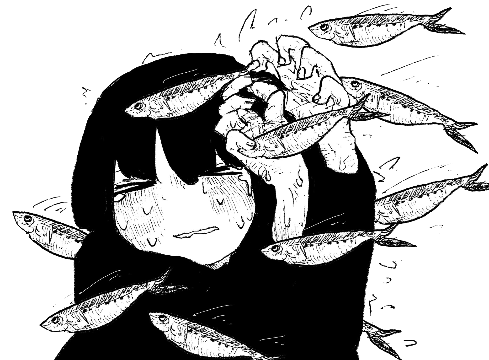

<h1>universe</h1>

```ocaml
A CLUMSY WIZARD'S ESSENTIALS
```

<hr><br>

## About

<div align="center">

```ocaml
POWERED BY HORRIBLE DECISIONS AND LOTS OF COFFEE
```

</div>

As this repo contains my dotfiles for my systems, it's always WIP. I use NixOS with Niri on both my main PC, and my work laptop. I am new to the whole flake thing, but I think I did a relatively decent job with making a "good enough" system.

My initial thoughts were to make a system that's components are relatively easy to read, but still modular enough to modify per hardware. Initially when I started using Nix for the very first time I didn't even know about flakes, so compared to that what I have now is way better.

## Screenshots

<div align="center">

```ocaml
ARCANE PROJECTIONS
```

</div>


## The structure

<div align="center">

```ocaml
HERETICAL BUILD
```

</div>

- `dots`: Some static files, for now only scripts that go into `~/.local/bin`
- `extra`: Right now it's just some icons and wallpapers that I use or used to use. Needs cleaning.
- `modules`: The main parts of my config.
  - `apps`: WM specific set of apps, and generics (ones that I use everywhere)
  - `shells`: Fish. That's all I need to configure for now.
  - `wms`: Configuration files for the window managers I use.
  - `apps` and `wms` all have a WM folder, and inside those folders `home` and `system` folders, for... home and system configs.....
    - *Where there is a `home` and `system` folder, in the parent folder there will always be a `home.nix` and a `system.nix` as well.*
- `setups`: Mainly just imports from modules, but setup specific configs as well.
- `root`: This is obsolete and will eventually be deleted.

## Inspirations and credits

<div align="center">

```ocaml
DEFINITELY NO R/UNIXPORN HERE
```

</div>

No, really. I wanted something more practical than flashy so I avoided looking at r/unixporn...

The current version is based on a previous set of dots I made for Arch Linux but never published, and that version was based off [Speyll's dotfiles](https://github.com/Speyll/dotfiles/). Obviously huge shoutout to the people working on the [Catppuccin Nix flakes](https://nix.catppuccin.com), they are the real heroes in my dotfiles, 99% of my theming was done with it at first. Some other notable mentions:

- [Stylix](https://nix-community.github.io/stylix/) - all my new new themes are done with it. It's awesome.
- [UBlue's (and specifically Bazzite's) boot-windows](https://github.com/ublue-os/bazzite/blob/main/system_files/desktop/shared/usr/bin/boot-windows)
- [hyprcap](https://github.com/alonso-herreros/Hyprcap)
- [The NixOS Discord](https://discord.gg/BqdJJFER4H)

## How-to?

<div align="center">

```ocaml
FORBIDDEN KNOWLEDGE
```

</div>

>[!NOTE]
>This repo is very much not for human consumption. Proceed with care.

The recommended way of using these dots is to not use them. They are highly personalized to my taste, and my taste is weird.

If you want to try them, just fork this repo, then make your own changes to it, because I have my own hardware specific configurations in here too. It is recommended to use the minimal NixOS installer for this, and install straight from the flake. Make sure to overwrite the `hardware.nix` files inside of `modules/setups/<system>`.

## Miscellaneous

<div align="center">

```ocaml
THE WITCHES' CODE
```

</div>

If you decide to use my config for whatever reason, first of all I admire your bravery, second of all I'd love it if you credited me. That's pretty much it.